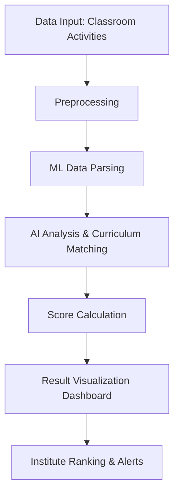

# TechSpectra
Smart Monitoring System for Classroom Activities using ML to analyze 7,000+ images, classifying activities like teaching, discussions, and seminars. Automates evaluation of skill development programs, identifies underperforming institutions, and improves training effectiveness. Designed for efficient monitoring and enhanced learning outcomes.

# 📊 AI-Powered Classroom Monitoring System  
### 🧠 Smart India Hackathon 2024 – Team TechSpectra  
**Problem Statement ID:** 1719  
**Theme:** Smart Education  
**Category:** Software  

---

## 🚀 Overview

🎯 **Goal**  
Develop an AI-driven system to monitor classroom sessions, evaluate training effectiveness, assess curriculum relevance, and highlight underperforming institutes — all visualized through an intelligent dashboard.

💡 **Why It Matters**  
Ineffective teaching and outdated curriculum in skill programs hinder student success. Our system empowers institutions to self-improve with real-time analytics.

---

## 🧩 Key Features

✅ Real-time Classroom Monitoring  
✅ AI-Based Institute Performance Scoring  
✅ Curriculum vs. Market Relevance Checker  
✅ Interactive Dashboards for Trends & Alerts  
✅ Predictive Analytics for At-Risk Institutes  
✅ Secure, Flexible & Scalable Architecture  

---

## 🛠️ System Architecture

## 🧪 Technical Approach

| 🔁 **Layer**         | 📋 **Description** |
|----------------------|--------------------|
| 🔍 **Data Input**     | Physical + digital activity logs from classrooms |
| 🧼 **Preprocessing**   | Cleansing & structuring data for accuracy |
| 🤖 **ML Parsing**      | Extracting patterns & activity insights |
| 📈 **AI Evaluation**   | Performance scoring + curriculum relevance via market comparison |
| 📊 **Visualization**   | Intuitive dashboards for institute ranking, trends, and intervention alerts |

---

## 📈 Dashboard Preview

> **Visualizations include:**  
> ✅ Scorecards  
> ✅ Trend graphs  
> ✅ Institute rankings  
> ✅ Curriculum relevancy index

---

## 🔐 Feasibility, Challenges & Mitigations

| 💡 **Aspect**     | 🔍 **Details** |
|-------------------|----------------|
| ✅ **Feasibility** | Works with varied classroom settings, pre-trained models, minimal setup |
| ⚠️ **Challenges**  | Data privacy, activity diversity, environment-specific generalization |
| 🛡️ **Solutions**   | Strong encryption, flexible algorithms, regular model tuning |

---

## 🌍 Impact & Benefits

- 🎓 **Social:** Personalized learning, improved training outcomes  
- 💸 **Economic:** Cost-effective, no need for retraining models frequently  
- 🌱 **Environmental:** Digital shift = less paper, travel, and energy waste  
- 🔁 **Continuous Feedback Loop** for institutional improvement  
- 📊 **Data-Driven Decisions** = higher educational standards  

---

## 💡 Unique Selling Points

✔️ Early-Warning System for At-Risk Institutes  
✔️ Curriculum Relevancy Benchmarking  
✔️ Peer Comparison Reports  
✔️ Real-Time Automated Feedback for Trainers  
✔️ Predictive Analytics for Student Outcomes  

---

## 🧩 Tech Stack

| ⚙️ **Component**     | 🛠️ **Technology**         |
|----------------------|---------------------------|
| 🐍 Backend            | Python                    |
| 🧠 Machine Learning   | Scikit-learn, OpenCV      |
| 🧮 AI Platform        | Google Vertex AI          |
| 📊 Visualization      | Chart.js, D3.js           |
| 🔐 Security           | JWT, HTTPS, DB Encryption |
| ☁️ Database (Future) | Firebase, MongoDB         |

---

## 🔗 References

- [📄 AI-based Monitoring System – MDPI Paper](https://www.mdpi.com/2504-2289/7/1/48)  
- [🧠 Computer Vision for Education Monitoring](https://rb.gy/f3bbbo)  
- [🧮 Google Vertex AI](https://ai.google.dev/gemini-api/docs/quickstart?lang=python)  
- [📦 OpenCV-Python](https://pypi.org/project/opencv-python/)  
- [🎥 Video Explanation](https://drive.google.com/drive/folders/1wTiOvkfS4TPEdS3nGeXw9hNWEbO3kWdi)

---

## 👨‍💻 Team Info

| 👥 **Team Name** | 🧠 TechSpectra |
|------------------|---------------|
| 🆔 **Team ID**     | 38685         |
| 🏆 **Achievements** | Winners of National-Level Hackathons (SIH, Hack-a-Sol, etc.) |

---

## 🖼️ Website Snapshots (UI Screens & Dashboard Previews)

> 📷 Below are mockups and screenshots of our AI dashboard, classroom monitoring system, and curriculum evaluation reports.

---

📌 _Live deployment coming soon!_

Methodology:

